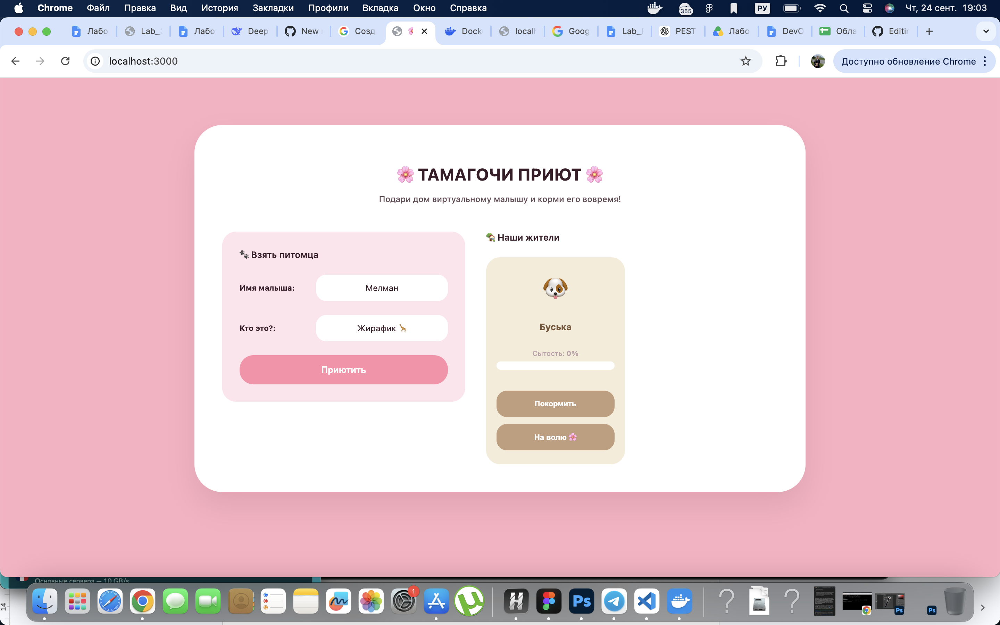
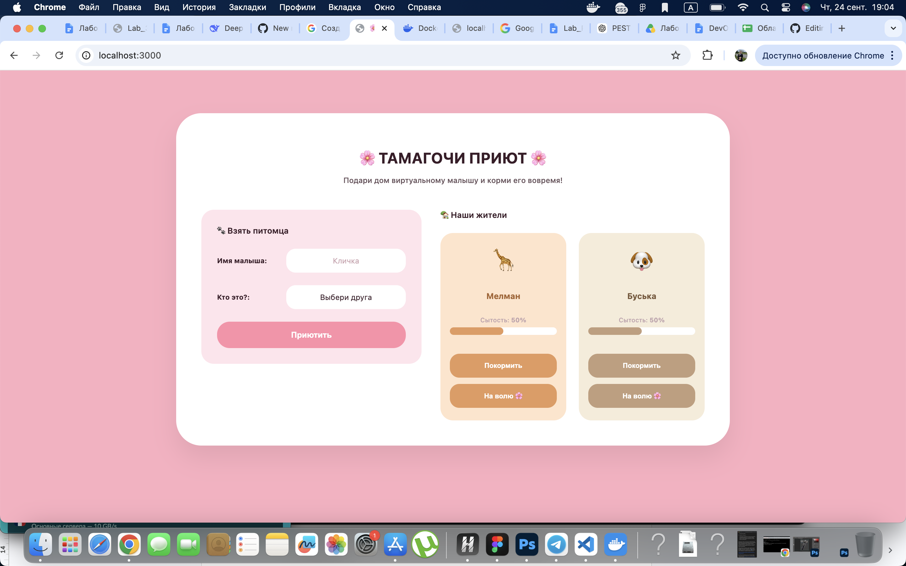
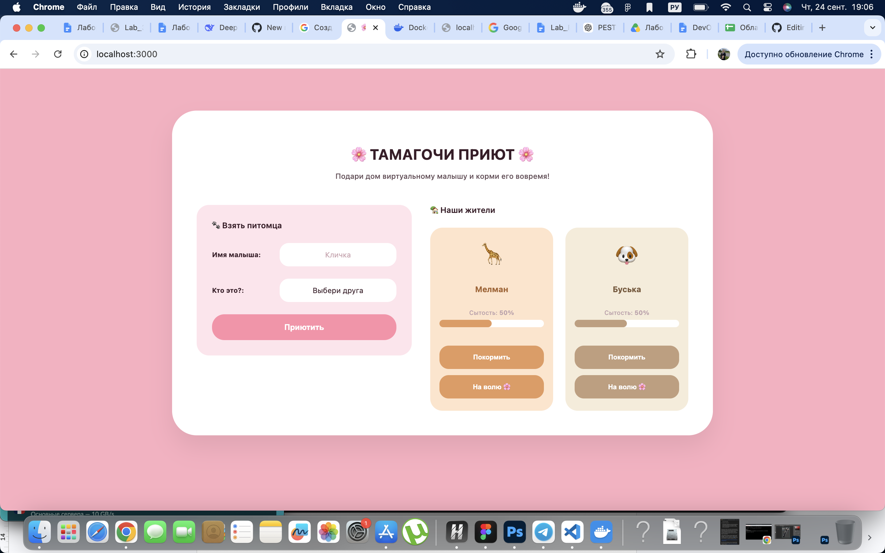
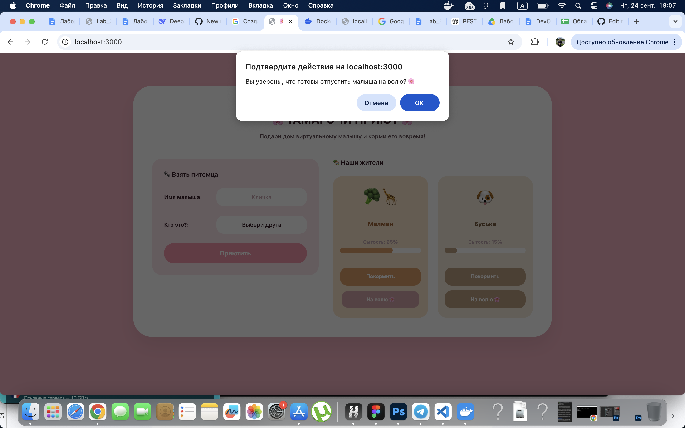
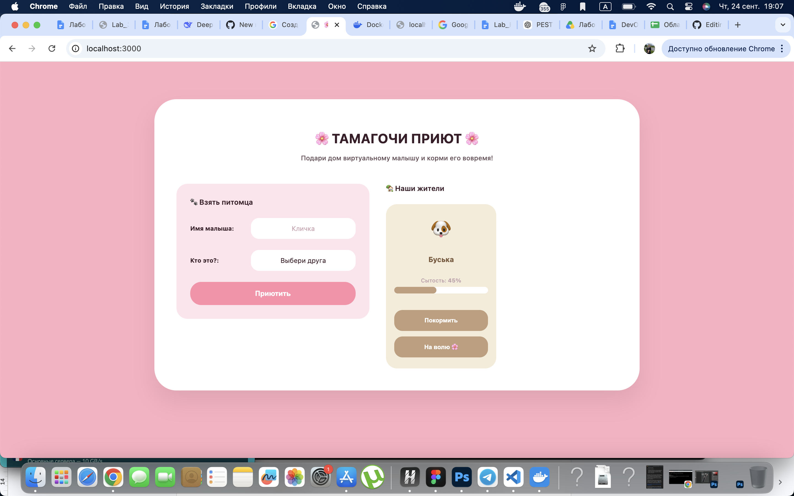

### Отчёт по Лабораторной работе №0 🌸

**Тема:** Создание базового CRUD-сервиса для DevOps-пайплайна
**Выполнила:** Настя (и её MacBook Air, который очень старался) 

### 👋 Введение (или зачем мы здесь собрались)

В рамках Лабы 0 нам нужно было создать основу для всего курса — простенький сервис с фронтендом, бэкендом и базой данных. Чтобы не делать очередную унылую напоминалку (тудушку) или планер, которые сдают абсолютно все, было решено сделать **Тамагочи-Приют** :333 и даже можно приютить жирафика (я тоже обожаю жирафиков, я мечтала его увидеть с 5 лет и увидела в живую первый раз в 16 лет, правда он повернулся ко мне попой:<)

Логика идеальна для лабы: мы можем добавлять зверушек, кормить их (изменять состояние в базе) и отпускать на волю (удалять). Заодно навели сумасшедшую пастельно-розовую красоту во фреймворке SCSS, добавили индивидуальные цвета карточек для Капибар 🦦 и Пёселей 🐶, а Жирафика 🦒 научили кушать брокколи, когда он сыт. 

### 🏗️ Как это устроено под капотом (простыми словами)

Проект состоит из трех китов, которые сначала очень не хотели общаться друг с другом из-за капризов мака (ноута, а не ресторана), но мы их подружили: 

1. **Фронтенд (frontend/)**: Милая розовая страничка. Написана на чистом HTML и JS. Стили упакованы в .scss, потому что мы ценим красивый код, вложенность и миксины, а потом скомпилированы в style.css. Чтобы статика не открывалась через унылый двойной клик по файлу (file://), фронт крутится на честном локальном хосте http://localhost:3000 через встроенный питоновский сервер.
2. **Бэкенд (backend/)**: Сердце приюта на **FastAPI (Python)**. Ловит запросы от фронта, считает проценты сытости и общается с базой. Сидит на порту 8000.
3. **База данных (Docker)**: Настоящая суровая **PostgreSQL**. Мы подняли её в Docker-контейнере tama-db на порту 5432.

*Драма лабы:* Локальный Docker на Mac сначала наотрез отказался связываться с терминалом из-за сломанных путей к сокету (Cannot connect to the Docker daemon). Мы уже почти сдались и хотели уйти на SQLite, но вовремя починили системные ссылки, почистили порты от старых забытых проектов и запустили Postgres как положено по ТЗ! 

### 🧪 Тест-драйв приюта (Доказательство CRUD-цикла )

Чтобы доказать, что у нас тут не статическая картинка, а серьезный инженерный проект, мы провели полный цикл проверок. 

### 1. Операция CREATE (Приютить малыша)

Открываем http://localhost:3000. В левой панели пишем кличку (например, Мелман), выбираем вид животного ("Жирафик") и жмем «Приютить». На бэкенд улетает POST-запрос, FastAPI делает INSERT в PostgreSQL, и справа мгновенно вылетает карточка. Питомцу автоматически выставляется стартовая сытость 50%. 

### 2. Операция READ (Перезагрузка страницы)

Самый ответственный момент. Обновляем вкладку браузераи наш Мелман не исчез! Бэкенд успешно выполнил SELECT * FROM pets из базы в Докере, подтянул данные, а фронт всё красиво отрисовал. Ничего не сбросилось в ноль. 

### 3. Операция UPDATE (🍖 Покормить!)

Жмем кнопку «Покормить». На бэк уходит POST-запрос на эндпоинт /feed, сытость в базе увеличивается на +10%. Если раскормить питомца больше 80%, срабатывает пасхалка — смайлик превращается в супер-сытый и довольный.
*Дополнительный прикол:* На фронте тикают часики (setInterval), которые у всех на глазах уменьшают сырость на 5% каждые 4 секунды. Приходится кликать мышкой, чтобы животные не грустили. Полоска прогресса при этом на лету меняет цвет с зеленого на тревожный красный. 

### 4. Операция DELETE (На волю 🌸)

Наш приют — временный дом, мучить животных мы не хотим. Жмем кнопку «На волю 🌸». Браузер переспрашивает, уверены ли мы. Соглашаемся — улетает DELETE-запрос, строчка стирается из PostgreSQL, карточка исчезает. База снова чиста. 

### 📑 Выводы по работе

Лаба 0 успешно сделана! Мы создали модульное приложение, где каждый занимается своим делом. Мы научились компилировать SCSS, запускать локальные сервера, прокидывать CORS-заголовки, чтобы браузер не ругался, и реанимировать Docker Desktop на macOS. 

Проект полностью готов к Лабе 1, где мы засунем перед всем этим добром **Nginx**, чтобы избавиться от путаницы с портами 3000 и 8000.
