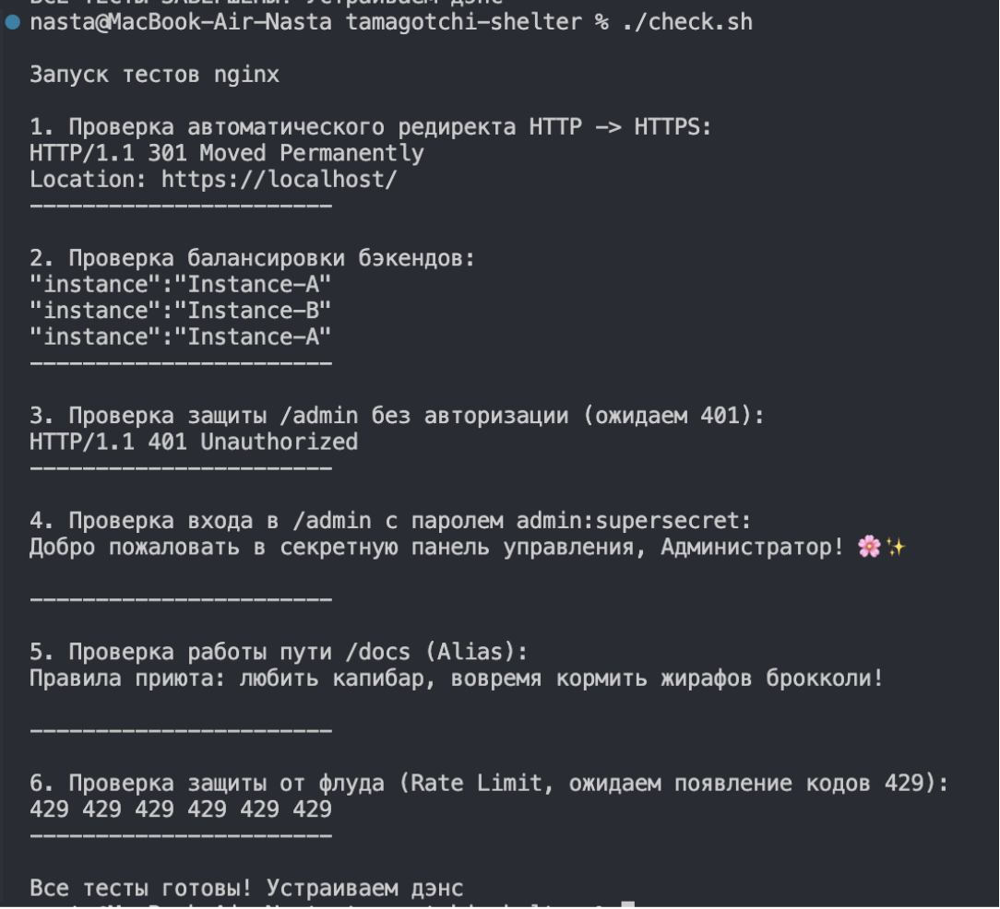
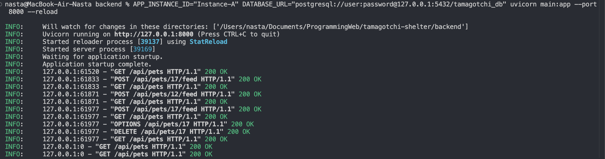
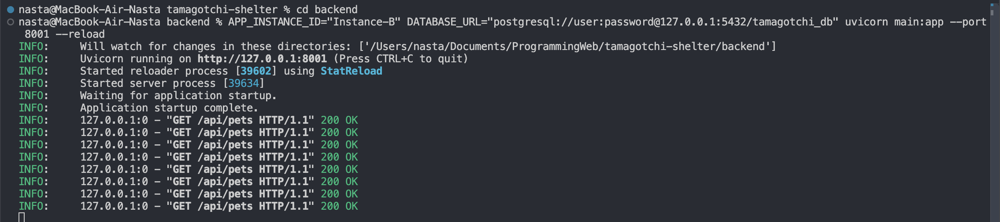
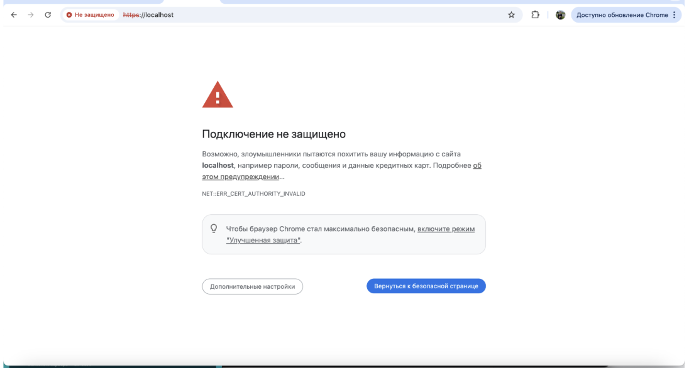
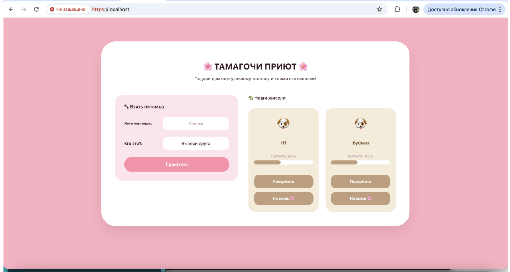
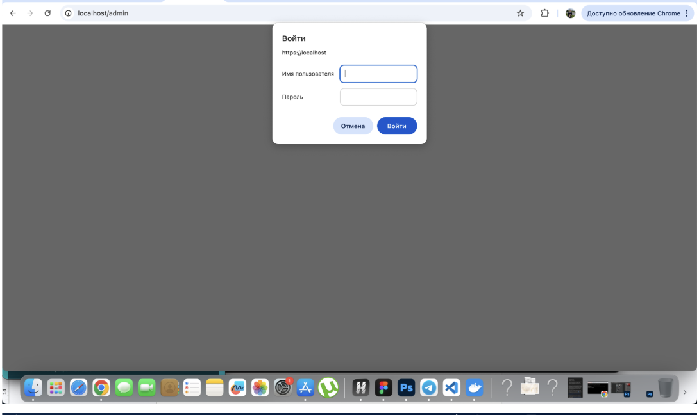
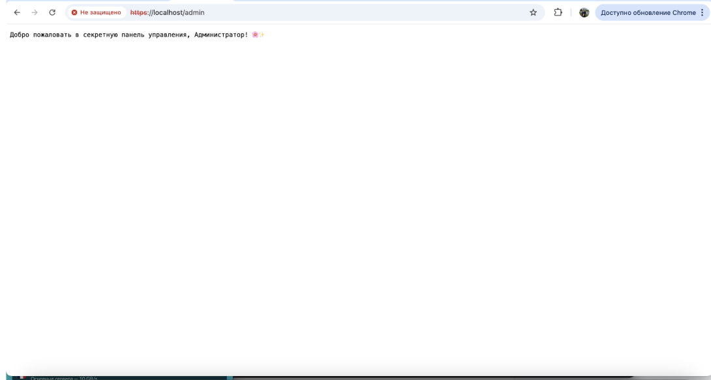
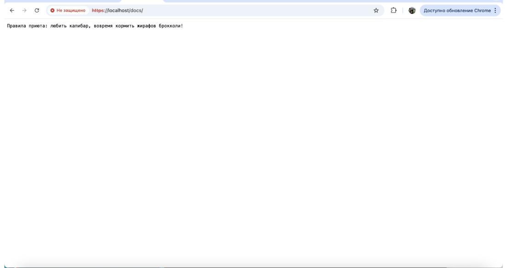
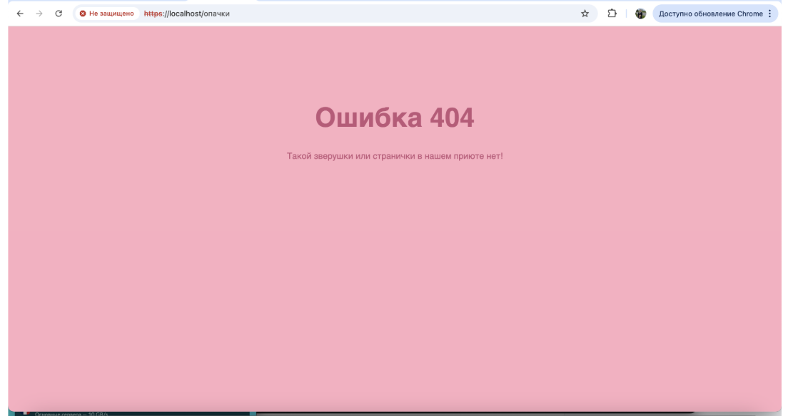

### Отчёт по Лабораторной работе №1 

**Тема:** Использование веб-сервера Nginx в качестве Reverse Proxy и балансировщика

### Введение

В Лабе 0 наш сервис работал фрагментарно: фронтенд сидел на порту 3000, бэкенд — на порту 8000, а браузер постоянно ругался из-за CORS-ограничений при попытке настроить их взаимодействие. 

В Лабе 1 я установила перед проектом единую точку входа — веб-сервер **Nginx**. Он занял стандартные порты 80 (HTTP) и 443 (HTTPS), объединив статику фронтенда и API бэкенда под одним общим адресом localhost. Для внешнего мира приют стал монолитным сайтом, а проблемы с CORS и путаница с портами исчезли навсегда. 

### Реализованная архитектура и конфигурация (nginx.conf)

Конфигурационный файл был полностью адаптирован под требования ТЗ и архитектуру macOS: 

1. **Балансировка (Upstream)**: Я подняла два инстанса Python-бэкенда (на портах 8000 и 8001). Nginx распределяет запросы между ними. В каждый ответ бэкенда подмешивается APP_INSTANCE_ID, чтобы наглядно отслеживать факт чередования серверов.
2. **Шифрование трафика (SSL)**: Сгенерировала самоподписанные сертификаты. Nginx принудительно перенаправляет любой незащищенный HTTP-трафик на HTTPS (код 301).
3. **Ограничение частоты (Rate Limit)**: Настроила зону api_limit (1 запрос в секунду с одного IP) для защиты приюта от флуда запросами.
4. **Авторизация админки (Basic Auth)**: Закрыла путь /admin паролем с использованием файла htpasswd (логин: admin, пароль: supersecret).

### Хроника выполненных настроек: Проблемы на Mac :(

Развертывание Nginx на маке превратилось в полноценный квест...

### Проблема 1. Ошибка устаревших CommandLineTools в Homebrew

При попытке установить сервер через brew install nginx система выдала критическую ошибку, заявив, что утилиты разработчика Apple слишком старые. Команда nginx через sudo выдавала command not found. Поэтому я почистила системные хосты и обновила компоненты, правда из-за Apple Silicon запускать его пришлось по абсолютному пути: /opt/homebrew/bin/nginx

### Проблема 2. Неверная кодировка (кракозябры) в Админке

 После ввода логина и пароля на странице /admin вместо приветствия вывелась каша из непонятных символов. Браузер не понимал кириллицу в сыром текстовом файле. Оказывается нужно было добавить директиву charset utf-8; внутрь блоков location /admin и location /docs

### Проблема 3. Маскировка Rate Limit под ошибку 404

 При флуде запросами автоматические тесты ожидали увидеть код блокировки 429, но Nginx упорно возвращал 404.
Лимит срабатывал так быстро, что Nginx путался в контексте путей бэкенда при поиске файла ошибки. И тут я познала **именованный location** (location @too_many_requests). Это внутренний виртуальный блок кода в памяти Nginx, не привязанный к дисковым путям. Он мгновенно выплёвывает строчку *"Слишком много запросов!"* и чистый код 429 прямо из оперативной памяти, не нагружая бэкенд.

### Результаты автоматических тестов check.sh

Наш проверочный скрипт на базе curl полностью подтвердил корректную работу всей конфигурации: 

1. **Редирект:** Отрабатывает автоматически (HTTP/1.1 301 Moved Permanently).
2. **Балансировка:** Запросы четко распределяются между Instance-A и Instance-B.
3. **Админка:** Без пароля выдает 401 Unauthorized, а с правильными кредами пускает внутрь.
4. **Rate Limit:** При спаме выдает ровный ряд кодов 429 429 429....

### Проверяем что сделали

### 1. Результаты автотестов check.sh

На скриншоте виден успешный прогон всех проверок и заветные коды 429 в самом конце:

### 2. Параллельный запуск двух инстансов бэкенда FastAPI
Скриншот терминалов VS Code, подтверждающий одновременную работу Instance-A на порту 8000 и Instance-B на порту 8001:

### 3. Главная страница приюта через HTTPS (localhost)

Наш дизайн приюта успешно раздаётся силами Nginx. Браузер выводит предупреждение NET::ERR_CERT_AUTHORITY_INVALID — это подтверждает, что трафик зашифрован нашим самоподписанным SSL-сертификатом:
 

### 4. Защищённая админка (/admin)

Окно ввода Basic-авторизации и успешный вход с отображением корректного русского текста без кракозябр:

### 5. Кастомная страница ошибки 404 и Alias /docs

Демонстрация работы псевдонимов путей для документов и нашей страницы 404

## Заключение и выводы

В ходе выполнения лабораторной работы №1 были освоены ключевые принципы работы с веб-сервером Nginx, его интеграции с бэкенд-платформами и защиты сетевой инфраструктуры. 

### Основные результаты работы:
* **Интеграция фронтенда и бэкенда:** Настройка Nginx в режиме Reverse Proxy позволила объединить раздачу статических файлов и проксирование API на одной точке входа (`localhost`), что полностью устранило проблемы с CORS-политиками браузера.
* **Балансировка — залог крепкого сна:** Мы научились размножать бэкенды на разные порты и распределять нагрузку. Теперь, даже если один инстанс упадёт из-за наплыва любителей капибар, приют продолжит жить на втором дыхании.
* **Безопасность данных:** На практике реализовано шифрование трафика по протоколу HTTPS с помощью самоподписанных SSL-сертификатов, а также ограничение доступа к административной панели (`/admin`) через Basic-авторизацию.
* **Ограничение частоты запросов (Rate Limiting):** Настроена защита API от чрезмерного наплыва запросов. Использование механизма *именованных локаций* (`@too_many_requests`) позволило возвращать ошибку 429 напрямую из памяти сервера, оптимизируя потребление ресурсов хоста.

